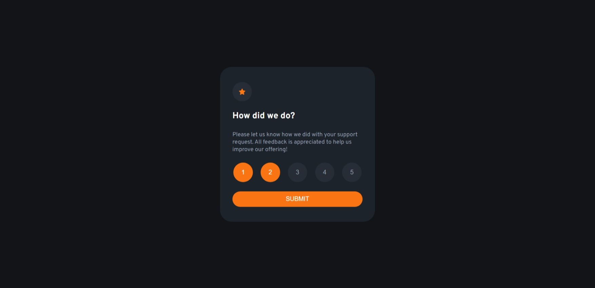

# Frontend Mentor - Interactive rating component solution

This is a solution to the [Interactive rating component challenge on Frontend Mentor](https://www.frontendmentor.io/challenges/interactive-rating-component-koxpeBUmI). Frontend Mentor challenges help you improve your coding skills by building realistic projects. 

## Table of contents

- [Overview](#overview)
  - [The challenge](#the-challenge)
  - [Screenshot](#screenshot)
  - [Links](#links)
- [My process](#my-process)
  - [Built with](#built-with)
  - [What I learned](#what-i-learned)
  - [Continued development](#continued-development)
  - [Useful resources](#useful-resources)
- [Author](#author)
- [Acknowledgments](#acknowledgments)

**Note: Delete this note and update the table of contents based on what sections you keep.**

## Overview

### The challenge

Users should be able to:

- View the optimal layout for the app depending on their device's screen size
- See hover states for all interactive elements on the page
- Select and submit a number rating
- See the "Thank you" card state after submitting a rating

### Screenshot



### Links

- Solution URL: [Add solution URL here](https://your-solution-url.com)
- Live Site URL: [Add live site URL here](https://your-live-site-url.com)

## My process

### Built with

- Semantic HTML5 markup
- CSS custom properties
- Flexbox
- CSS Grid
- Mobile-first workflow
- JQuery

### What I learned

This line of code is for the star selection and i take help of the chatGPT and that's why it's so special. it automatically deselect the other stars when i click on the lower star. also select all the stars when i click on some higher number.

```js
$(document).ready(function() {
  $(".miniBox").on("click", function() {
    // Remove the active class from all buttons
    $(".miniBox").removeClass("activeBox-1");
    // Add the active class to the clicked button
    $(this).addClass("activeBox-1");
    // Change the color of previous buttons
    $(this).prevAll(".miniBox").addClass("activeBox-1");
  });
});
```

### Continued development

This challenge is complete and i have also created one from React. As i promised in that file, i have created this project Responsive.

### Useful resources

- [Example resource 1](https://www.example.com) - This helped me for XYZ reason. I really liked this pattern and will use it going forward.
- [Example resource 2](https://www.example.com) - This is an amazing article which helped me finally understand XYZ. I'd recommend it to anyone still learning this concept.

## Author

- Github - [The-Bipu](https://github.com/the-bipu)
- Frontend Mentor - [@the-bipu](https://www.frontendmentor.io/profile/the-bipu)

## Acknowledgments

This is where you can give a hat tip to anyone who helped you out on this project. Perhaps you worked in a team or got some inspiration from someone else's solution. This is the perfect place to give them some credit.